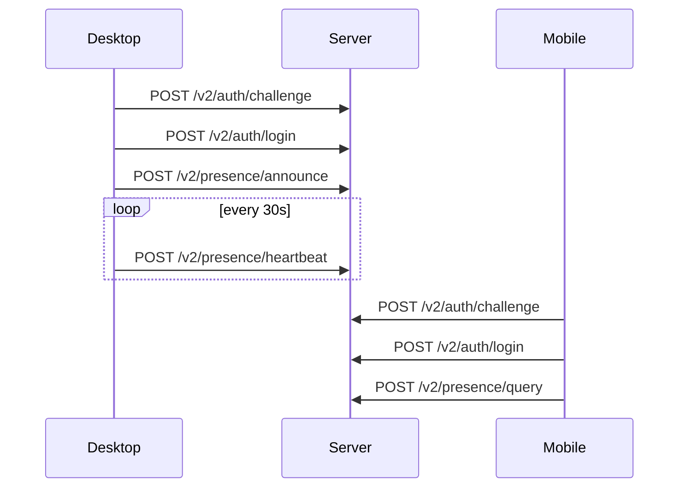
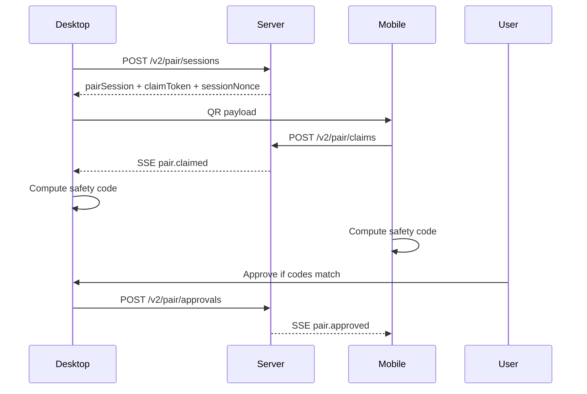
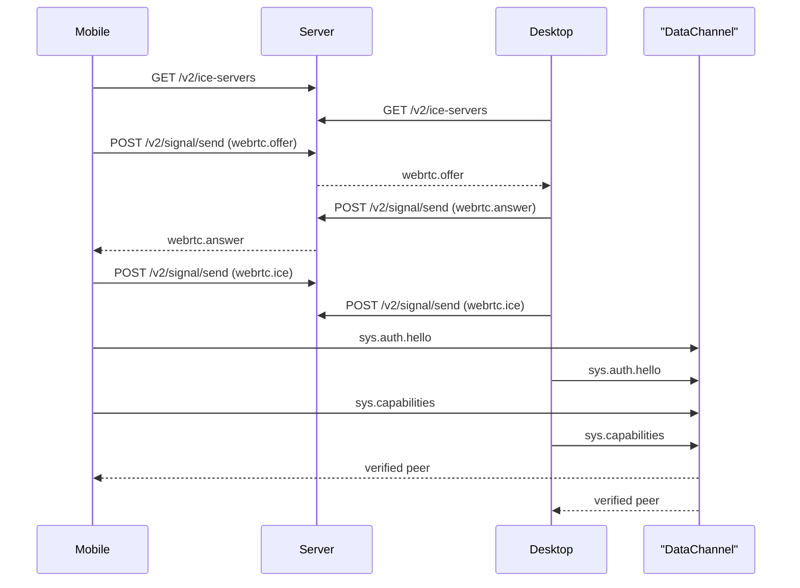

# Remote Pairing v2 Protocol

Note:

- This document describes the current `v2` control/auth/message layering.
- The next-generation non-backward-compatible chat/group direction is documented in [remote-pairing-crdt-v3.md](/Users/zhangruiqiang/dev/setupclaw/docs/remote-pairing-crdt-v3.md).

This document splits `v2` into a reusable protocol stack so we can clearly separate:

- server-assisted discovery/presence/pairing/signaling
- peer-to-peer identity verification
- application-specific payload contracts

That split is what makes the protocol **mostly business-agnostic**.

## Interoperability Boundary

- If another app implements the same **L1 control plane** and **L2 peer auth** rules, it can pair and establish a trusted peer channel with OpenClaw-compatible clients.
- To exchange useful business data after connect, both sides must also share the same **L3 application message** contract.
- Today the control/auth layers are reusable; the sample business payload namespace is still OpenClaw-specific.

## Layering

### L0 Identity

- Entity types: `desktop`, `mobile`
- Identity key type: `Ed25519`
- Identity scope: long-lived per local install/profile
- Server role: stores public keys, does **not** become trust root

### L1 Control Plane

Transport:

- HTTP JSON request/response
- SSE for server-to-client signaling fanout

Responsibilities:

- challenge/login
- desktop presence announce + heartbeat
- pair session creation
- claim / approve / revoke
- binding list
- signaling relay
- ICE server delivery

### L2 Peer Authentication Plane

Transport:

- WebRTC DataChannel

Responsibilities:

- verify the remote peer is the trusted desktop/mobile bound in `binding_id`
- verify the remote long-lived public key matches the approved binding
- exchange post-auth system metadata such as peer capabilities
- reject all application payloads until peer auth succeeds

### L3 Application Plane

Transport:

- authenticated WebRTC DataChannel messages after L2 succeeds

Rules:

- reserve `sys.*` for protocol/system messages
- reserve `app.<vendor>.*` for app/business messages
- OpenClaw sample message currently uses `app.openclaw.chat.message`

Current system message set:

- `sys.auth.hello`
- `sys.capabilities`

## Core Structures

### Auth Challenge

```json
{
  "challengeId": "v2chl_xxx",
  "entityType": "desktop",
  "entityId": "desk_123",
  "publicKey": "base64url-ed25519",
  "nonce": "nonce_xxx",
  "createdAt": 1710000000000,
  "expiresAt": 1710000300000
}
```

### Auth Session

```json
{
  "sessionId": "v2sess_xxx",
  "token": "v2tok_xxx",
  "entityType": "mobile",
  "entityId": "mob_123",
  "publicKey": "base64url-ed25519",
  "createdAt": 1710000000000,
  "updatedAt": 1710000000000,
  "expiresAt": 1710086400000
}
```

### Binding

```json
{
  "bindingId": "v2bind_xxx",
  "pairSessionId": "v2pair_xxx",
  "deviceId": "desk_123",
  "devicePublicKey": "base64url-ed25519",
  "mobileId": "mob_123",
  "mobilePublicKey": "base64url-ed25519",
  "trustState": "active",
  "createdAt": 1710000000000,
  "updatedAt": 1710000000000,
  "approvedAt": 1710000005000,
  "revokedAt": null
}
```

### Signal Event

```json
{
  "id": "evt_xxx",
  "type": "webrtc.offer",
  "ts": 1710000000000,
  "from": {
    "type": "mobile",
    "id": "mob_123"
  },
  "to": {
    "type": "desktop",
    "id": "desk_123"
  },
  "payload": {
    "bindingId": "v2bind_xxx"
  }
}
```

### ICE Response

```json
{
  "ok": true,
  "iceServers": [
    {
      "urls": ["stun:stun.cloudflare.com:3478"]
    },
    {
      "urls": ["turn:turn.example.com:3478?transport=udp"],
      "username": "user",
      "credential": "pass"
    }
  ],
  "ttlSeconds": 600
}
```

## L1 Interfaces

| Method | Path | Auth | Purpose |
| --- | --- | --- | --- |
| `POST` | `/v2/auth/challenge` | No | Create signed-login challenge |
| `POST` | `/v2/auth/login` | No | Verify challenge signature and issue bearer token |
| `POST` | `/v2/presence/announce` | Desktop | Mark desktop online and publish metadata |
| `POST` | `/v2/presence/heartbeat` | Desktop | Refresh desktop liveness |
| `POST` | `/v2/presence/query` | Mobile | Query desktop online/offline state |
| `POST` | `/v2/pair/sessions` | Desktop | Create QR claim session |
| `POST` | `/v2/pair/claims` | Mobile | Claim QR session and create pending binding |
| `POST` | `/v2/pair/approvals` | Desktop | Confirm safety code and activate binding |
| `POST` | `/v2/signal/send` | Desktop/Mobile | Relay `pair.*` / `webrtc.*` / app control events |
| `GET` | `/v2/signal/stream` | Desktop/Mobile | SSE signal stream |
| `GET` | `/v2/ice-servers` | Desktop/Mobile | Fetch current ICE/TURN config and cache TTL |

## L2 Peer Auth Contract

### Message Type

```json
{
  "type": "sys.auth.hello",
  "bindingId": "v2bind_xxx",
  "entityType": "mobile",
  "entityId": "mob_123",
  "publicKey": "base64url-ed25519",
  "nonce": "550e8400-e29b-41d4-a716-446655440000",
  "signature": "base64url-ed25519-signature"
}
```

### Signature Preimage

```text
openclaw-v2-peer-hello
{bindingId}
{entityType}
{entityId}
{publicKey}
{nonce}
```

### Verification Rules

- `bindingId` MUST match the active binding used for signaling
- `entityType` MUST be the opposite side of the current role
- `entityId` MUST equal the trusted peer ID stored in the binding
- `publicKey` MUST equal the trusted peer public key stored in the binding
- `signature` MUST verify against that trusted public key
- Any non-`sys.auth.hello` payload received before verification MUST be ignored

## L3 Application Message Contract

Recommended namespace:

- `app.<vendor>.<feature>.<action>`

Generic envelope:

```json
{
  "type": "app.vendor.feature.action",
  "ts": 1710000000000,
  "from": "desktop",
  "payload": {}
}
```

Current OpenClaw sample:

```json
{
  "type": "app.openclaw.chat.message",
  "ts": 1710000000000,
  "from": "desktop",
  "payload": {
    "text": "hello"
  }
}
```

That means:

- another app can reuse L1/L2 and define its own `app.otherapp.*` payloads
- another app can fully interoperate with OpenClaw chat only if it also implements `app.openclaw.chat.message`

## System Capability Message

After both sides verify `sys.auth.hello`, each side sends:

```json
{
  "type": "sys.capabilities",
  "protocolVersion": "openclaw-pair-v2",
  "appId": "openclaw",
  "appVersion": "0.2.0",
  "features": ["chat"],
  "supportedMessages": [
    "sys.auth.hello",
    "sys.capabilities",
    "app.openclaw.chat.message"
  ]
}
```

Rules:

- `supportedMessages` declares the message types this peer is willing to receive
- `sys.auth.hello` and `sys.capabilities` are always treated as protocol-reserved system messages
- business payloads SHOULD be sent only when the peer has advertised support for that message type
- `PairV2PeerChannel` only routes generic `app.*` envelopes; application modules interpret the business payload
- clients may register multiple app modules behind a shared dispatcher/registry, so adding a new business capability does not require changing the peer-transport core
- OpenClaw chat currently checks for `app.openclaw.chat.message` before sending once capability data is known

## Sequences

### Presence + Discovery



### Pair + Trust Activation



### Signaling + Peer Verification



## Current Server Config Inputs

- `V2_ICE_SERVERS_JSON`: JSON array of WebRTC ICE server entries
- `V2_ICE_TTL_SECONDS`: client cache TTL for `/v2/ice-servers`

If `V2_ICE_SERVERS_JSON` is unset, server currently returns the built-in public STUN defaults.
