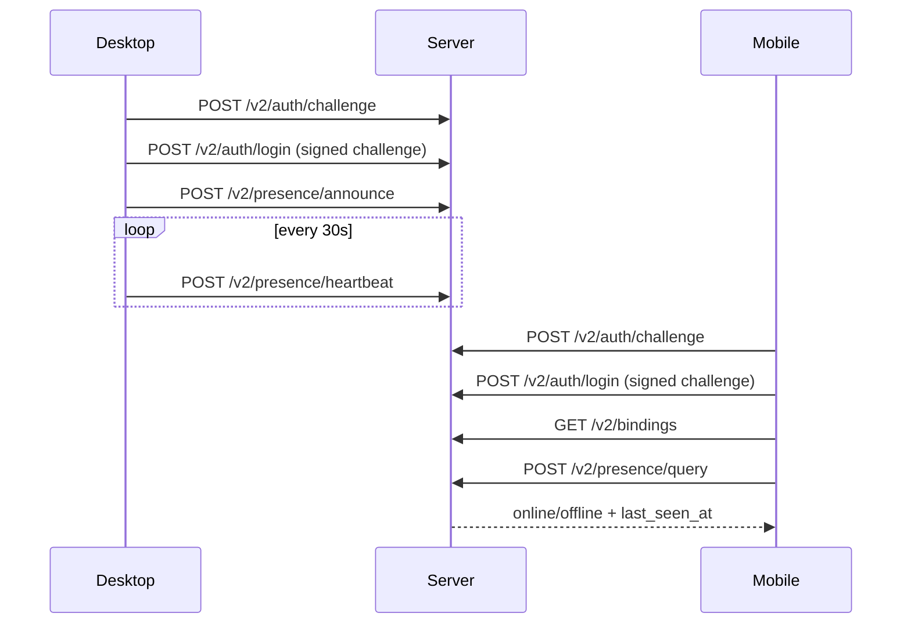
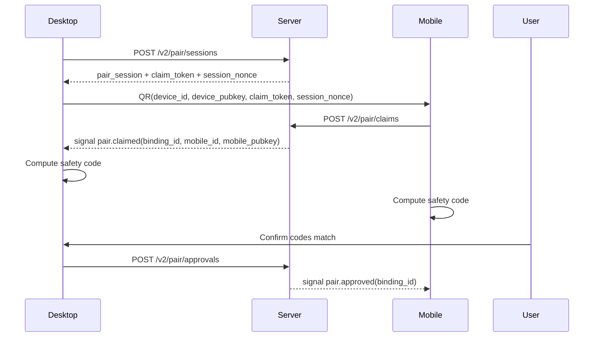
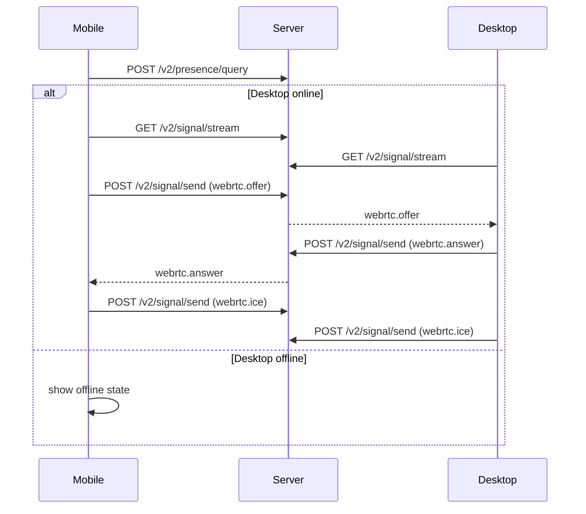

# Remote Pairing v2

`v2` replaces the current server-token-driven MVP with a device-identity-driven design.

## Goals

- Let desktop announce presence to the server with a stable `device_id`
- Let mobile query the status of its bound desktops and connect only when they are online
- Bind trust to long-lived device identity keys instead of server-issued peer tokens
- Keep the server responsible for discovery, pairing orchestration, signaling relay, and optional TURN support
- Keep business traffic end-to-end authenticated and ready for end-to-end encryption

## Non-goals

- Backward compatibility with `v1`
- Server-side decryption of business payloads
- Key rotation and multi-profile account sync in the first `v2` milestone

## Cryptography

- Long-lived identity key: `Ed25519`
- Transport establishment: WebRTC signaling via server, data plane via WebRTC DataChannel
- Identity proof during login: client signs server challenge with `Ed25519`
- Identity proof during peer connect: clients sign connection material with their trusted long-lived keys

## Trust Model

- Desktop trusts the desktop public key embedded in the QR code because the user reads the QR from that desktop
- Mobile public key is not automatically trusted by desktop just because it arrived through the server
- Desktop and mobile must display the same locally computed safety code and require explicit user confirmation on desktop before a binding becomes active
- Server may coordinate pairing and relay messages, but it is not the trust root for peer identity

## Core Data Structures

### Device identity

```json
{
  "device_id": "desk_123",
  "device_pubkey": "base64url-ed25519",
  "platform": "macos",
  "app_version": "0.2.0",
  "capabilities": {
    "webrtc": true
  },
  "last_seen_at": 1710000000000,
  "presence_status": "online"
}
```

### Mobile identity

```json
{
  "mobile_id": "mob_123",
  "mobile_pubkey": "base64url-ed25519",
  "updated_at": 1710000000000
}
```

### Binding

```json
{
  "binding_id": "bind_123",
  "device_id": "desk_123",
  "device_pubkey": "base64url-ed25519",
  "mobile_id": "mob_123",
  "mobile_pubkey": "base64url-ed25519",
  "trust_state": "pending",
  "pair_session_id": "pair_123",
  "created_at": 1710000000000,
  "approved_at": null,
  "revoked_at": null,
  "updated_at": 1710000000000
}
```

### Pair session

```json
{
  "pair_session_id": "pair_123",
  "device_id": "desk_123",
  "device_pubkey": "base64url-ed25519",
  "claim_token": "secret-random-token",
  "session_nonce": "random-nonce",
  "status": "pending",
  "created_at": 1710000000000,
  "expires_at": 1710000180000
}
```

### Auth session

```json
{
  "session_id": "sess_123",
  "entity_type": "desktop",
  "entity_id": "desk_123",
  "public_key": "base64url-ed25519",
  "issued_at": 1710000000000,
  "expires_at": 1710086400000
}
```

## QR Payload

Desktop creates a QR payload from the pair session:

```json
{
  "version": "openclaw-pair-v2",
  "server_base_url": "https://api.openclawapp.dev",
  "pair_session_id": "pair_123",
  "claim_token": "secret-random-token",
  "device_id": "desk_123",
  "device_pubkey": "base64url-ed25519",
  "session_nonce": "random-nonce",
  "expires_at": 1710000180000
}
```

## Safety Code

Desktop and mobile compute the same short confirmation code locally:

```text
SHA-256(device_pubkey || mobile_pubkey || pair_session_id || session_nonce)
```

Use the first 20 bits to render a 6-digit decimal safety code.

The safety code is never treated as a secret. Its purpose is human confirmation that both peers saw the same public keys.

## Presence Flow



## Pairing Flow



## Reconnect Flow



## API Surface

### Authentication

- `POST /v2/auth/challenge`
  - input: `entityType`, `entityId`, `publicKey`
  - output: `challengeId`, `nonce`, `expiresAt`
- `POST /v2/auth/login`
  - input: `entityType`, `entityId`, `publicKey`, `challengeId`, `signature`
  - output: bearer token session

### Presence

- `POST /v2/presence/announce`
  - desktop only
  - updates `platform`, `appVersion`, `capabilities`, `lastSeenAt`
- `POST /v2/presence/heartbeat`
  - desktop only
  - updates `lastSeenAt`
- `POST /v2/presence/query`
  - mobile queries bound desktops
  - desktop can query itself

### Pairing

- `POST /v2/pair/sessions`
  - desktop only
  - creates short-lived claim token and session nonce
- `POST /v2/pair/claims`
  - mobile only
  - creates `pending` binding and emits `pair.claimed` signal
- `POST /v2/pair/approvals`
  - desktop only
  - moves binding from `pending` to `active`
- `POST /v2/pair/revoke`
  - desktop or mobile peer
- `GET /v2/bindings`
  - returns bindings visible to caller

### Signaling

- `GET /v2/signal/stream`
  - SSE for `desktop:<device_id>` or `mobile:<mobile_id>`
- `POST /v2/signal/send`
  - relays `pair.*`, `webrtc.*`, and later business control messages
- `GET /v2/ice-servers`
  - returns the authenticated client's current ICE server list and cache TTL

## Server Responsibilities

- Store long-lived public keys for desktop and mobile identities
- Track desktop online presence
- Maintain binding records and pair-session lifecycle
- Relay signaling events
- Provide STUN/TURN server config for WebRTC bootstrap, with room for temporary TURN credentials later

## Client Responsibilities

- Generate and persist long-lived identity keys
- Compute and display safety code locally
- Reject connection handshakes whose signatures do not verify against trusted peer public keys
- Encrypt and authenticate application traffic end-to-end over the established peer channel

## Initial Rollout

1. Land `v2` auth, presence, pair session, claim, approval, binding list, revoke, and signal relay on the server
2. Update desktop to use `v2` for register/login, pair QR creation, pending-claim approval, and signaling
3. Update mobile to use `v2` for login, binding sync, presence query, claim, and signaling
4. Switch post-pair live communication from relay payloads to WebRTC DataChannel

## Current Implementation Notes

- `v2` server state is currently designed as in-memory first
- Signal relay can still reuse the existing Redis-backed external queue path
- Persistent storage for `v2` identities and bindings can be added after the protocol stabilizes
- Desktop and mobile now negotiate a WebRTC DataChannel over `webrtc.offer` / `webrtc.answer` / `webrtc.ice`
- The DataChannel performs an application-level signed `sys.auth.hello` handshake using each side's long-lived `Ed25519` identity before accepting business payloads
- After `sys.auth.hello`, peers exchange `sys.capabilities` so application traffic can remain business-specific and explicitly negotiated
- The peer channel now routes generic `app.*` envelopes; OpenClaw chat is one concrete application module on top of that
- Server now exposes `GET /v2/ice-servers`; desktop and mobile prefer the server-provided list and fall back to local/default STUN config if the endpoint is unavailable
- Desktop may still define `channelIceServers` in `openclaw.config.json` as the local fallback during development or when the server does not supply TURN data
