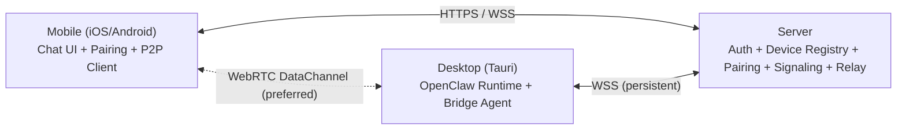
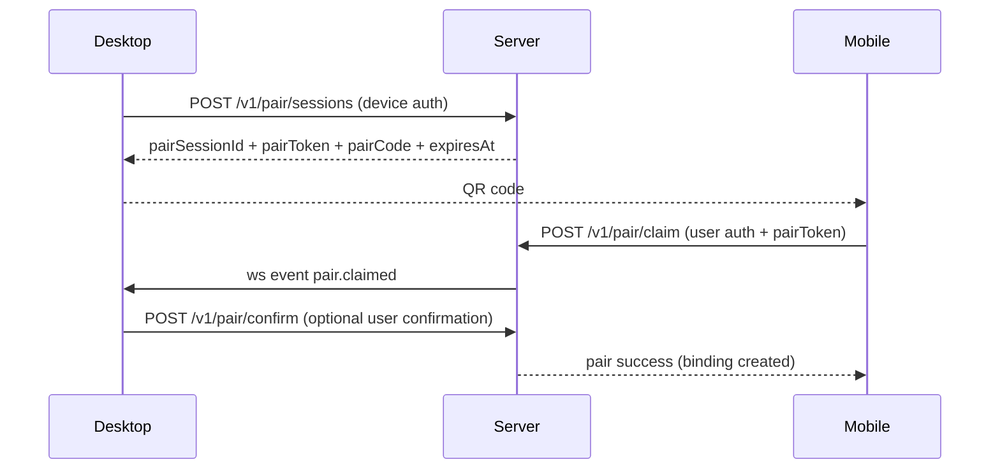

# OpenClaw 三端系统设计（Desktop / Mobile / Server）

## 1. 目标与边界

本设计覆盖三端协作：

- `desktop`：OpenClaw 桌面端（PC 执行端，负责运行 OpenClaw 内核）
- `mobile`：移动端（iOS / Android 聊天客户端）
- `server`：服务端（注册、配对、鉴权、信令与回退路由）

核心目标：

1. 移动端支持扫码或输入配对码与 PC 绑定。
2. PC 端可主动向服务端注册设备信息并保持在线。
3. 配对成功后优先建立移动端与 PC 的直连通信，失败时自动回退中继，保证可用性。

非目标（当前阶段）：

- 不做群聊/多方会话。
- 不做完全去中心化发现（仍依赖服务端完成配对与信令）。

## 2. 总体架构



设计原则：

- 控制面走服务端（注册、鉴权、配对、信令）。
- 数据面优先 P2P（WebRTC DataChannel），失败自动降级为服务端 Relay。
- PC 与服务端保持长连接，便于推送配对事件和连接协商。

## 3. 三端职责

## 3.1 Desktop（PC）

- 打包并运行 OpenClaw 内核（本地执行任务）。
- 启动后向服务端注册设备基础信息并保持心跳。
- 发起配对会话（生成二维码 / 配对码）。
- 处理移动端请求并执行任务，回传结果。
- 与移动端优先走直连通道，失败时走服务端中继通道。

## 3.2 Mobile（iOS / Android）

- 提供聊天 UI 与会话管理。
- 登录后扫码或输入配对码绑定设备。
- 发起连接协商并与 PC 建立通信通道。
- 发送任务消息、接收进度与结果。
- 在后台通过 APNs/FCM 唤醒后恢复连接。

## 3.3 Server

- 用户鉴权（移动端）与设备鉴权（PC 端）。
- 设备注册与在线状态管理。
- 配对会话签发、校验、绑定。
- WebRTC 信令转发（offer/answer/ice）。
- 直连失败时作为消息中继（Relay）。

## 4. 通信模型

## 4.1 通道优先级

1. `P2P`: WebRTC DataChannel（优先）
2. `Relay`: Server WSS 双向转发（回退）

## 4.2 消息封装（统一协议）

```json
{
  "id": "msg_01H...",
  "sessionId": "sess_01H...",
  "traceId": "trc_01H...",
  "from": {"type": "mobile|desktop", "id": "xxx"},
  "to": {"type": "mobile|desktop", "id": "xxx"},
  "type": "chat.message|task.create|task.progress|task.result|ack|error",
  "timestamp": 1710000000000,
  "payload": {},
  "needAck": true
}
```

规则：

- `needAck=true` 的消息必须回 ACK（携带被确认的消息 ID）。
- 基于 `id` 做幂等去重。
- `task.*` 流程严格顺序：`task.create -> task.accepted -> task.progress -> task.result|task.error`。

## 5. 配对设计（扫码 + 配对码）

## 5.1 配对会话

PC 调用服务端创建一次性配对会话：

- `pairSessionId`
- `pairToken`（短时、一次性）
- `pairCode`（6~8 位可手输）
- `expiresAt`（建议 2~5 分钟）

二维码内容建议：

```json
{
  "v": 1,
  "pairSessionId": "ps_01H...",
  "pairToken": "pt_...",
  "server": "https://api.openclawapp.dev"
}
```

## 5.2 配对流程（扫码）



## 5.3 配对流程（手输配对码）

- 移动端提交 `pairCode` 给 `/v1/pair/claim-by-code`。
- 服务端查找有效会话并执行与扫码同样绑定逻辑。

## 6. 直连建立与回退

## 6.1 直连建立

- 双方均与 Server WSS 保持控制连接。
- 通过 `signal.offer` / `signal.answer` / `signal.ice` 完成 WebRTC 协商。
- 使用 STUN + TURN（生产环境必须配 TURN）。

## 6.2 回退策略

- 直连协商超时（建议 8~12 秒）或 DataChannel 断开时，自动切到 Relay。
- Relay 模式对上层协议透明（复用相同消息 envelope）。

## 7. 鉴权与安全

## 7.1 身份体系

- Mobile：用户 JWT（access + refresh）。
- Desktop：设备凭证（首次注册签发 device token + 本地设备密钥对）。

## 7.2 安全要点

- 全链路 `https/wss`。
- `pairToken` 一次性且短时有效。
- 配对可选二次确认码（防误绑定）。
- 支持设备解绑和凭证轮换。
- 服务端记录审计日志（配对、登录、解绑、异常连接）。

## 8. 服务端模块拆分

- `auth-service`：用户/设备鉴权、token 签发与校验
- `registry-service`：设备注册、在线状态、心跳
- `pairing-service`：配对会话、绑定关系、解绑
- `signaling-service`：WebRTC 协商消息转发
- `relay-service`：直连失败的消息中继
- `push-service`：APNs/FCM 唤醒（移动端离线/后台）

## 9. 核心接口草案

设备与在线：

- `POST /v1/devices/register`
- `POST /v1/devices/heartbeat`
- `GET /v1/devices/:deviceId/status`

配对：

- `POST /v1/pair/sessions`
- `POST /v1/pair/claim`
- `POST /v1/pair/claim-by-code`
- `POST /v1/pair/revoke`
- `GET /v1/pair/bindings`

通信：

- `GET /ws/desktop`（PC 长连）
- `GET /ws/mobile`（移动端长连）
- WebSocket event: `signal.offer|signal.answer|signal.ice|relay.message|ack`

## 10. 客户端状态机（简化）

Desktop：

- `offline -> registering -> online -> pairing -> bound -> connected(p2p|relay)`

Mobile：

- `logged_out -> logged_in -> scanning|input_code -> bound -> connected(p2p|relay)`

## 11. 分阶段实施建议

Phase 1（MVP，2~3 周）：

- 设备注册、配对（扫码+配对码）、Relay 聊天链路跑通。
- 不做 WebRTC，先保证跨网稳定可用。

Phase 2（连接优化，2 周）：

- 引入 WebRTC DataChannel + STUN/TURN + 自动回退 Relay。

Phase 3（体验与可靠性，2 周）：

- APNs/FCM 唤醒、离线消息、重连优化、设备管理页（解绑/改名）。

## 12. 仓库落地映射

- `desktop/`：实现 Bridge Agent、配对 UI、通信通道切换
- `mobile/`：实现聊天 UI、扫码/输码配对、会话页
- `server/`：实现 auth/registry/pairing/signaling/relay
- `packages/protocol/`：沉淀消息 envelope 与事件 schema
- `packages/sdk-client/`：沉淀 ws/http/webRTC 客户端 SDK
